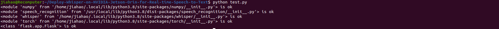

# Real Time Whisper On NVIDIA Jetson Nano

This is a demo of real time speech to text with OpenAI's Whisper model. It works on NVIDIA Jetson Nano and uses the microphone and speaker on the NVIDIA Jetson Nano Developer Kit.

## Hardware Requirements
- [reComputer](https://www.seeedstudio.com/reComputer-Industrial-J3011-p-5682.html?queryID=c1e6f0b0bd38a98233ce64bce8083a22&objectID=5682&indexName=bazaar_retailer_products) (Or other devices based on Jetson)
- [reSpeaker](https://www.seeedstudio.com/ReSpeaker-Mic-Array-v2-0.html?queryID=2baffb980bdb6d5e65b2b3f511657cb2&objectID=139&indexName=bazaar_retailer_products) (Or other USB interface microphones)
- Monitor, mouse, and keyboard 

## To install dependencies simply run
```shell
git clone https://github.com/LJ-Hao/Deploy-Whisper-on-NVIDIA-Jetson-Orin-for-Real-time-Speech-to-Text.git
cd Deploy-Whisper-on-NVIDIA-Jetson-Orin-for-Real-time-Speech-to-Text
pip install -r requirements.txt
sudo apt update && sudo apt install ffmpeg
```
And you can use following command to check wheather the dependencies install successfully.
```shell
python test.py
```
If you can see the following result, it means that the dependencies are installed successfully.


## Run this command to set the microphone rate
```shell
nvidia@nvidia-desktop:~$ arecord -D hw:2,0 --dump-hw-params
```
## Run this command to start the demo
```shell
python main.py
```
## Result

For more information on Whisper please see https://github.com/openai/whisper

